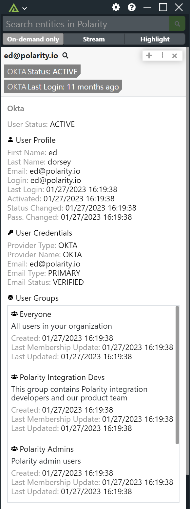

# Polarity Okta Integration

Okta is a customizable, secure, and drop-in solution to add authentication and authorization services to your applications. The Polarity Okta integration allows you to search for Okta users by email address.

To learn more about Okta, visit the [official website](https://www.okta.com/).

## Okta Integration Options

### Okta URL

URL for your Okta instance.  The URL should include the scheme (https://).

### Okta API Token

API Token required to authorize with Okta.

## Default Domains to Search

A comma delimited list of domains that will be searched when doing email lookups in Okta. If left blank, all email addresses will be searched.

## Installation Instructions

Installation instructions for integrations are provided on the [PolarityIO GitHub Page](https://polarityio.github.io/).

## Polarity

Polarity is a memory-augmentation platform that improves and accelerates analyst decision making. For more information about the Polarity platform please see:

https://polarity.io/
